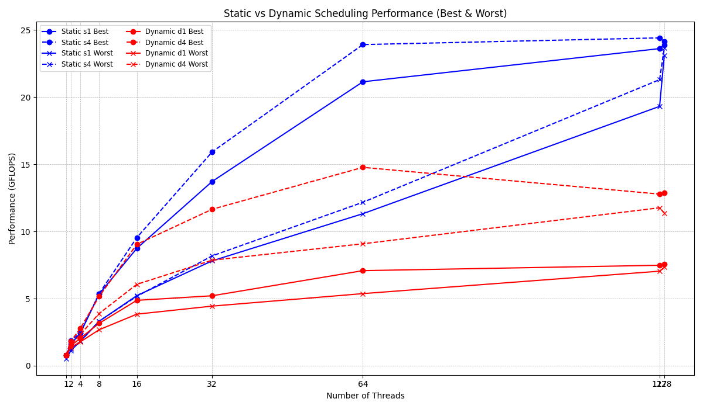

# Experimental Data and Explanations

## Question 1
Given Code: Increments the values of elements in an array:

Goal: `dest[i] = i + 1 (src[i] = i)`, and compare it against `destS` which has been set to the same sequentially.

Sequential Code:
`destS[i] = src[i]+1;`

Parallel Code (Given): `#pragma omp parallel private(i)`

Problem: The separate `#pragma omp parallel` regions without synchronization caused multiple threads to run independent loops concurrently, leading to race conditions and undefined behavior because the threads could overlap in execution without waiting for each other to finish, resulting in incorrect updates to the shared array, output can be seen in `buggy.grn054.433709.log` file..

Solution: I replaced separate `#pragma omp parallel` blocks with `#pragma omp parallel for` loops, which include implicit barriers ensuring that each parallel loop completes before the next serial code or parallel loop begins. This prevented race conditions and guarantees correct ordering and data consistency as can be seen from the `buggy.grn060.433710.log` file.

## Question 2

## 2a
The output can be seen in the `trmm_par_ijk.grn053.433587.log` file.
Observations:
| File        | Pass/Fail  |
|-------------|------------|
| `trmm_par_i`| Pass       |
| `trmm_par_j`| Pass       |
| `trmm_par_k`| Fail       |

Conclusion: Parallelizing the k loop is unsafe without proper reduction handling. The error shows either a race condition or uninitialized memory access. Further research suggests that this could be because of the incorrect access to the sum, multiple threads can write to the same address at the same time.

Performance Comparison:

|Threads|	`trmm_par_i`|   `trmm_par_j`|   Notes                   |
|-------|---------------|---------------|---------------------------|
| 1	    |   0.77 GFLOPS	|   0.78 GFLOPS	|   Comparable to serial    |
| 32	|   6.79 GFLOPS	|   8.86 GFLOPS	|   j loop slightly better  |
| 64	|   16.09 GFLOPS|	16.53 GFLOPS|  	Nearly equal            |
| 127	|   25.94 GFLOPS|	22.72 GFLOPS|	i loop better           |
| 128	|   28.56 GFLOPS|	22.74 GFLOPS|	i loop clearly better   |

Conclusion:
- `trmm_par_i` scales better as we increase the number of threads.
- `trmm_par_j` performs well at moderate thread counts but plateaus earlier.
- `trmm_par_k` is excluded due to correctness failure.

## 2b
Fastest Version: `trmm_par_i_s1.c` (chunk size = 1)
- Best GFLOPS at 128 threads: 52.45
- With chunk size = 1, each thread gets one iteration at a time.
- This leads to fine-grained load balancing, especially helpful when some i iterations take longer than others.
- Threads stay busy and idle time is minimized.

Slowest Version: `trmm_par_i_s_default.c` (default chunk size)
- Best GFLOPS at 128 threads: 28.75
- Default chunk size (`N / num_threads`), so each thread gets a large block of i iterations.
- If some blocks are heavier, threads finish at different times.
- This causes load imbalance and underutilization of cores.

Results can be seen in `trmm_static.grn056.433680.log` file.

## 2c
Fastest Version: `trmm_par_i_d_default.c` (dynamic, default chunk size)
- Best GFLOPS at 128 threads: 84.09
- With dynamic scheduling and default chunk size, OpenMP assigns iterations to threads as they become available.
- This leads to excellent load balancing, especially when iteration costs vary across i.
- Threads stay busy and adaptively pick up new work, minimizing idle time.

Slowest Version: `trmm_par_i_d4.c` (dynamic, chunk size = 4)
- Best GFLOPS at 128 threads: 41.95
- Chunk size of 4 reduces scheduling overhead compared to chunk size 1.
- However, it sacrifices some load balancing flexibility.
- Performance drops significantly at high thread counts, likely due to thread starvation or chunk granularity mismatch.

Results can be seen in `trmm_dynamic.grn052.433773.log` file.

## 2d
The plot can be seen in `scheduling_performance_2d.png`

Observations:
- Static scheduling (s1 and s4) consistently outperforms dynamic scheduling (d1 and d4), particularly as the thread count increases.
- Among static schedules, the version with chunk size 4 (s4) achieves the highest GFLOPS, peaking near 24 GFLOPS at high thread counts.
- Dynamic scheduling shows moderate gains but plateaus much earlier and at lower maximum GFLOPS compared to static.
- The "best" and "worst" runs converge with increasing threads for all variants, indicating improved stability in scaling at higher concurrency.
- For both static and dynamic, increasing chunk size from 1 to 4 improves performance, but the effect is more pronounced in static scheduling.
- The diminishing returns beyond 64 threads suggest overheads such as thread contention or memory bandwidth limitations in this environment.

Results can be seen in `trmm_stat_dyn_j_.grn052.433799.log` file.