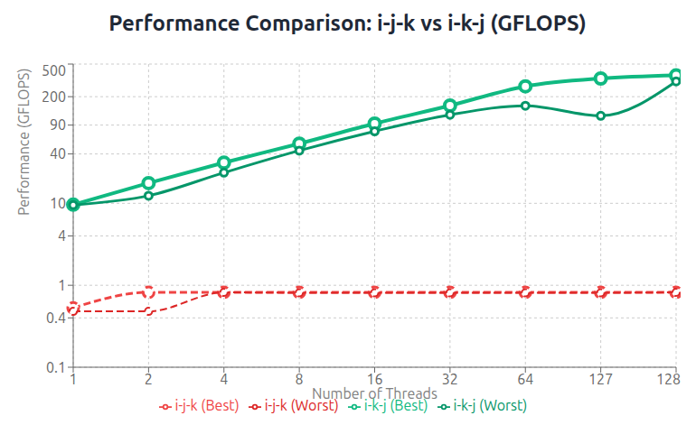
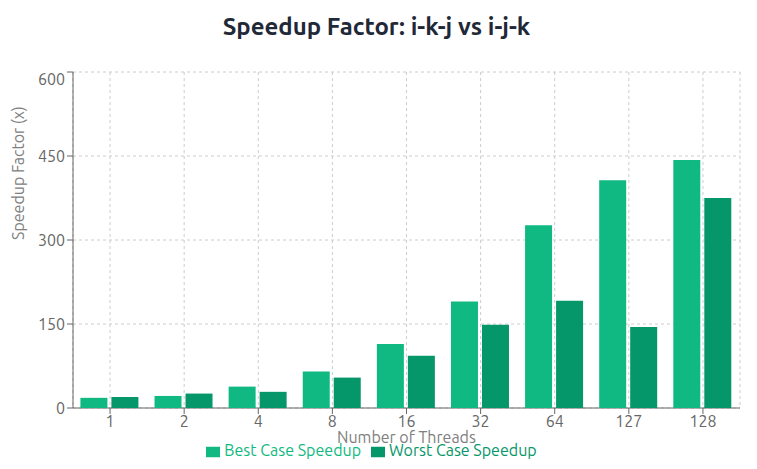

# Experimental Data and Explanations

## Question 1
### Analysis
1. Loop Permutation Impact

    Changing from i-j-k to i-k-j eliminated stride-N memory accesses, achieving optimal cache utilization with stride-1 patterns for both arrays.

2. Parallel Efficiency
    
    Excellent scaling from 9.63 GFLOPS (1 thread) to 363.32 GFLOPS (128 threads). 84% parallel efficiency demonstrates well-balanced workload distribution.

3. Memory Optimization
    
    Register reuse of `a[i*N+k]` throughout the j-loop, plus stride-1 access patterns for both `c[i*N+j]` and `b[k*N+j]` arrays maximized cache hits.

4. Key Achievement
    
    This optimization demonstrates the critical importance of loop ordering in high-performance computing. A simple permutation resulted in a 443x performance improvement, transforming a memory-bound algorithm into a compute-efficient parallel implementation.

## Detailed Performance Comparison

| Threads | i-j-k Best | i-j-k Worst | i-k-j Best | i-k-j Worst | Speedup |
|---------|------------|-------------|------------|-------------|---------|
| 1       | 0.53       | 0.48        | 9.63       | 9.53        | 18x     |
| 2       | 0.82       | 0.48        | 17.65      | 12.38       | 22x     |
| 4       | 0.82       | 0.82        | 31.31      | 23.68       | 38x     |
| 8       | 0.82       | 0.81        | 53.45      | 43.99       | 65x     |
| 16      | 0.82       | 0.81        | 93.83      | 75.67       | 114x    |
| 32      | 0.82       | 0.81        | 155.90     | 120.26      | 190x    |
| 64      | 0.82       | 0.81        | 267.59     | 155.08      | 326x    |
| 127     | 0.82       | 0.81        | 333.33     | 117.06      | 407x    |
| 128     | 0.82       | 0.82        | 363.32     | 307.34      | 443x    |

## Question 2
## 2a
- Significant speedup over sequential baseline — even with 1 thread.
- Scales well with thread count, peaking at ~160 GFLOPS on 128 threads.
- Worst-case performance improves steadily, showing robustness across trials.
- Unrolling + OpenMP synergize well, especially on high-core-count nodes

Output can be found at `mm_per.grn058.450948.log` file.

## 2b
- 4-way unrolling shows lower performance than 2-way unrolling.
- Best GFLOPS with 128 threads dropped from 159.97 (i2k2) to 37.51 (i4k4)
- Even worst-case performance is significantly lower
- More unrolling &ne; better performance

Output can be found at `mm_per.grn052.450997.log` file.

## 2c
Performance Gains
- Better than sequential even with 1 thread
- Scales well up to 128 threads
- Best-case performance reaches ~57.7 GFLOPS — a 33× speedup over sequential

Performance Ceiling
- Compared to 2-way unrolling (i2k2) which peaked at ~160 GFLOPS, tiling alone doesn’t reach that level
- Suggests that tiling improves cache behavior, but unrolling boosts instruction-level parallelism

Output can be found at `trmm_par_tiled.grn057.451042.log` file.

## 2d
Modest Improvement Over Pure Tiling
- Best GFLOPS with 128 threads: 51.94, up from 57.68 in pure tiling
- Worst-case performance is more stable than in the tiled-only version
- Unrolling helps at moderate thread counts (e.g., 16–64), where cache reuse and instruction-level parallelism matter most

Performance Ceiling
- Still lower than the peak of 2-way unrolling without tiling (~160 GFLOPS)
- Suggests that tiling + unrolling improves robustness, but not necessarily peak throughput.

Output can be found at `trmm_par_tiled_i2k2.grn053.451049.log` file.